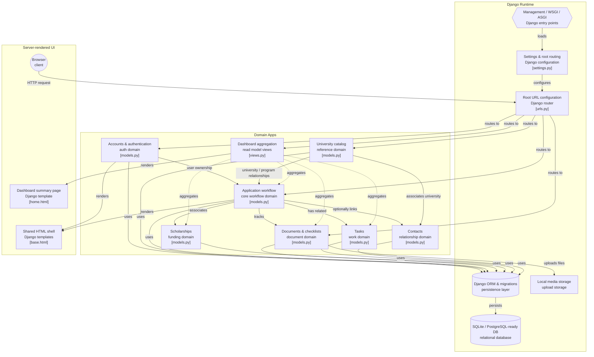

# Application Tracker — Architecture

## Overview

Application Tracker is a personal Django web application designed to manage the university and Master's application process from a single place.

The system follows a modular Django architecture where related functionality is separated into Django applications while sharing a common relational database and authentication system.

The application is intentionally built as a traditional Django application using:

* Django views
* Django templates
* Django forms
* Django ORM
* Server-side validation
* Vanilla JavaScript where client-side interaction is useful
* FileField for document uploads

A separate frontend framework or REST API is not currently required.

## Codebase & System Architecture

The following diagram provides a high-level view of the application's runtime,
domain applications, persistence layer, and server-rendered presentation layer.

It shows how the Django applications interact with the project's routing,
ORM, database, file storage, and templates.



## Architectural Goals

The architecture is designed around several principles:

1. Keep the application understandable and maintainable.
2. Keep business rules close to the models and forms where appropriate.
3. Protect user-owned data through explicit ownership filtering.
4. Use database constraints for rules that should always hold.
5. Avoid unnecessary architectural complexity.
6. Keep the system easy to extend as application requirements evolve.

## Django Applications

### `accounts`

Responsible for:

* Custom user model
* Authentication
* Registration
* Login and logout
* Account-related functionality

The project uses a custom user model based on Django's `AbstractUser`.

### `universities`

Responsible for:

* University records
* Academic programs
* University information
* Program information

Universities and programs act primarily as shared reference data within the personal application system.

### `applications`

Responsible for:

* University applications
* Application status
* Application deadlines
* Scholarship associations
* Submission and decision dates
* Application workflow
* Application detail views

This is the central domain of the system.

### `documents`

Responsible for:

* Reusable personal document library
* Document uploads
* Document metadata
* Application-specific document requirements
* Document readiness and submission status

The separation between `Document` and `ApplicationDocument` allows the same personal document to be reused across applications.

### `scholarships`

Responsible for:

* Scholarship reference data
* Scholarship providers
* Scholarship types
* Deadlines
* Coverage and stipend information
* Eligibility information
* Scholarship application URLs

Scholarships are independent reference records because one scholarship may be relevant to multiple applications.

### `contacts`

Responsible for:

* Professors
* Admissions officers
* Coordinators
* Supervisors
* Other university contacts
* Communication status
* Follow-up tracking

### `tasks`

Responsible for:

* General tasks
* Application-specific tasks
* Due dates
* Priorities
* Completion status
* Overdue task tracking

### `dashboard`

Responsible for aggregating information from the other applications into a single command-center view.

The dashboard is not a separate source of truth. It derives its information from application, task, document, and scholarship data.

## Domain Relationships

The application is centered around the `Application` entity.

```text
User
 │
 ├──────────────< Application
 │                    │
 │                    ├────────── University
 │                    │               │
 │                    │               ├──────< Program
 │                    │               │
 │                    │               └──────< Contact
 │                    │
 │                    ├────────── Program
 │                    ├────────── Scholarship
 │                    ├──────< ApplicationDocument >──── Document
 │                    ├──────< Task
 │                    └──────< Contact
 │
 ├──────────────< Document
 ├──────────────< Task
 └──────────────< Contact
```

## Ownership Model

The application is currently designed for a single authenticated user's personal workflow, but ownership is still explicitly represented in the data model.

User-owned entities include:

* Applications
* Documents
* Tasks
* Contacts

Views query these objects using the authenticated user.

For example, application queries should be scoped using:

```python
Application.objects.filter(user=request.user)
```

This prevents one authenticated user from accessing another user's records if the application is later extended to support multiple accounts.

Universities, programs, and scholarships are treated as shared reference data.

## Application Workflow

Applications use a flexible status model rather than a rigid state machine.

Possible statuses include:

```text
RESEARCHING
SHORTLISTED
PREPARING
APPLICATION_STARTED
SUBMITTED
UNDER_REVIEW
INTERVIEW
ACCEPTED
REJECTED
WITHDRAWN
```

The workflow is intentionally flexible because real university applications do not always follow a perfectly linear process.

For example, an application may move from:

```text
RESEARCHING
    ↓
SHORTLISTED
    ↓
PREPARING
    ↓
APPLICATION_STARTED
    ↓
SUBMITTED
    ↓
UNDER_REVIEW
    ↓
ACCEPTED
```

However, the system does not prevent legitimate changes such as moving backwards or updating a status based on real-world circumstances.

## Validation Strategy

Validation is performed at multiple levels.

### Form-level validation

Used for user-facing validation such as:

* Required fields
* Cross-field relationships
* User-friendly error messages
* Dynamic form behavior

### Model-level validation

Used for rules that belong to the domain itself.

Examples include:

* A selected program must belong to the selected university.
* Application timestamps must be logically ordered.
* Certain statuses require corresponding dates.
* Application document types must match attached document types.

### Database-level constraints

Used for rules that should remain true even if data is created outside the normal form workflow.

Examples include application uniqueness constraints.

## Query Optimization

Related objects are loaded deliberately where appropriate.

For example, the application detail view uses:

```python
.select_related(
    "university",
    "program",
    "scholarship",
)
.prefetch_related(
    "application_documents__document",
    "tasks",
    "contacts",
)
```

This reduces unnecessary database queries when rendering related application information.

Optimization is applied where there is a demonstrated relationship-loading need rather than indiscriminately across the project.

## File Handling

Documents use Django's `FileField`.

Uploaded documents are stored using a structured upload path:

```text
documents/%Y/%m/
```

User-uploaded media is stored under `media/` during development and excluded from version control.

## Security Considerations

Current security practices include:

* Django authentication
* Authenticated views for protected workflows
* User ownership filtering
* CSRF protection through Django forms/templates
* Environment-based secret configuration
* `.env` excluded from version control
* Database constraints
* Server-side validation
* Protected foreign-key relationships where accidental deletion would be dangerous

Production deployment will require additional security hardening.

## Architectural Decisions

The project intentionally does not currently use:

* React
* Django REST Framework
* Celery
* Redis
* Docker
* Microservices

These technologies may be appropriate in other systems, but they do not currently solve a problem that this application has.

The architecture can be expanded later if real requirements justify the additional complexity.
